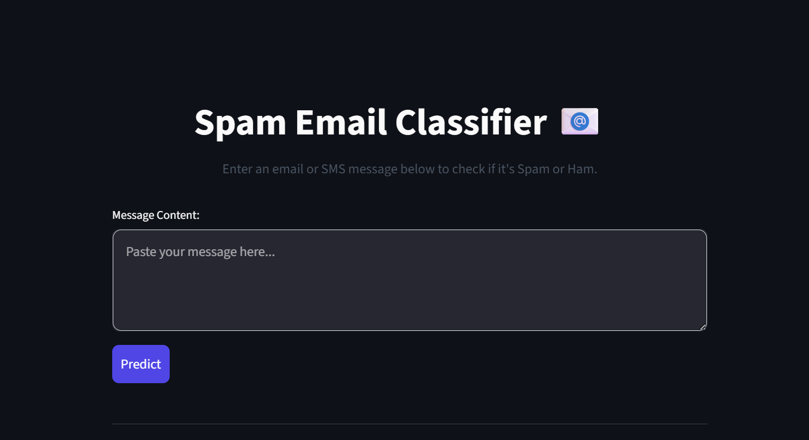
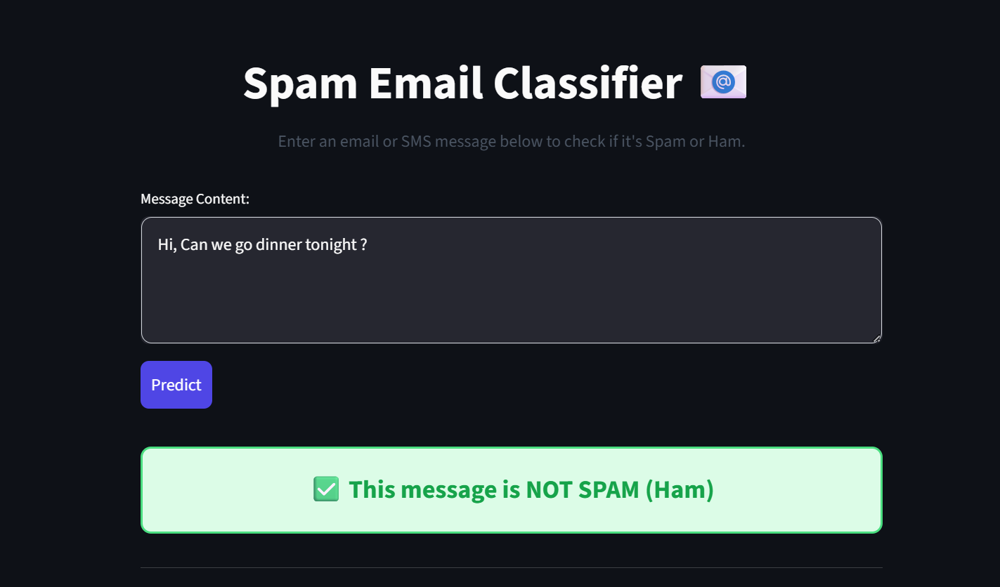
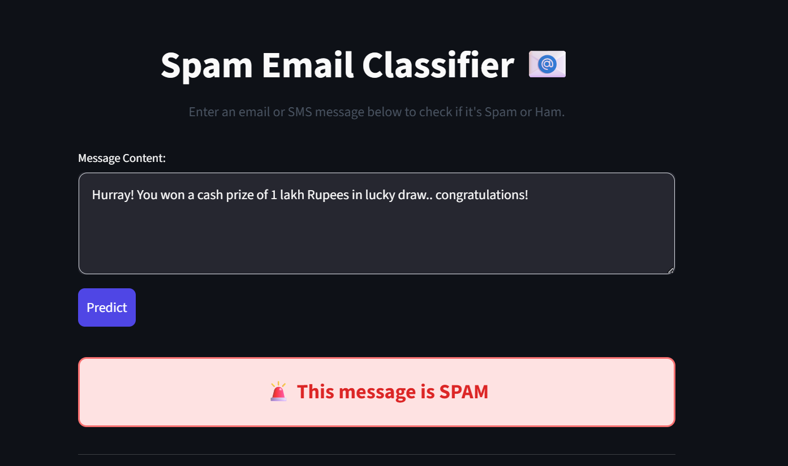

# Spam Email Classifier

A complete Machine Learning project that classifies emails and SMS messages as **Spam** or **Ham (Not Spam)**.

This project is built using **Python, Pandas, Scikit-learn, and Streamlit**, providing a clean, modern user interface for making predictions.

## 🚀 Features

- Automatically downloads and processes the SMS Spam Collection dataset.
- Cleans text data (lowercasing, punctuation removal, stopword removal).
- Uses **TF-IDF Vectorizer** for text representation.
- Trained using **Multinomial Naive Bayes** algorithm.
- Modern, centered UI built with **Streamlit** featuring dynamic styling (Red for Spam, Green for Ham).

## 📂 Project Structure

```
spam-email-classifier/
│
├── app.py               # Streamlit web application frontend
├── train_model.py       # ML script to load data, train, and save the model
├── spam.csv             # Cleaned dataset (generated automatically)
├── model.pkl            # Trained Naive Bayes model (generated automatically)
├── vectorizer.pkl       # TF-IDF Vectorizer (generated automatically)
├── requirements.txt     # Python library dependencies
└── README.md            # Project documentation
```

## 🛠️ Installation Steps

1. **Clone or Download the repository.**
2. **Navigate to the project directory** in your terminal:
   ```bash
   cd spam-email-classifier
   ```
3. **Install the required dependencies:**
   ```bash
   pip install -r requirements.txt
   ```

## 🏃‍♂️ How to Run the Project

**Step 1: Train the Model**
Run the training script to download the dataset, train the Naive Bayes model, and save `model.pkl` and `vectorizer.pkl`.
```bash
python train_model.py
```

**Step 2: Start the Web App**
Once the model is trained, launch the Streamlit frontend.
```bash
streamlit run app.py
```
This will open a new tab in your default web browser where you can enter text and test the classifier!


## 📸 Screenshots

### 🏠 Home Page



---

### ✅ Ham Prediction



---

### 🚨 Spam Prediction


